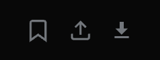
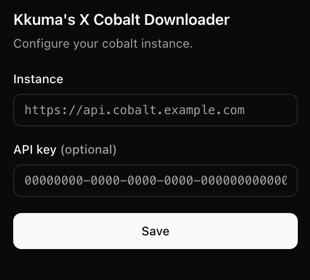

# kkuma cobalt

A small Chrome extension that adds a download button to posts on X/Twitter. It sends the tweet URL to your own [cobalt](https://github.com/imputnet/cobalt) instance and saves whatever comes back.

I built this because I got tired of copying tweet links over to a cobalt tab every time I wanted to save a video. Now there's just a button next to the reply/retweet/like row.

## What it looks like

The download button sits right next to the bookmark and share icons:

And the popup where you point it at your cobalt instance:

## Install

1. Clone or download this repo.
2. Go to `chrome://extensions`, turn on Developer mode.
3. Click "Load unpacked" and pick this folder.

## Setup

Click the extension icon and fill in:

- **Instance** — the URL of your cobalt instance (e.g. `https://api.cobalt.example.com`)
- **API key** — only if your instance requires one

Hit save. That's it.

## Using it

Scroll X like normal. Posts with media will have a little download arrow next to the other buttons. Click it, the file shows up in your downloads folder. Multi-image/video posts download all of them.

If something fails it'll show a short error on the button for a few seconds.

## Notes

- You need your own cobalt instance. This extension doesn't ship with a default one on purpose — please don't hammer public instances.
- Only works on `x.com` and `twitter.com`.
- Manifest V3, no tracking, no analytics, nothing leaves your browser except the request to your cobalt instance.
